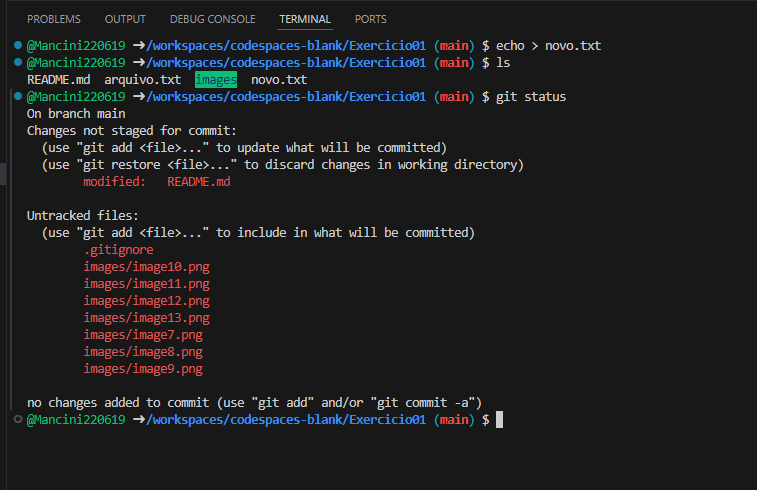

# Configurações e Comandos

Exercicio 01 - CI|CD - IMPACTA

## Passo a passo - códigos

```bash
mkdir Exercicio01
cd Exercicio01/
git init
git config --global user.name "Juliano Mancini"
git config --global user.email "julianomancini@gmail.com"
ls
ls .git/
```


A. No diretorio workspace, criaremos o arquivo.txt
```bash
echo 01 > arquivo.txt
ls
```


B. Conferindo status e adicionando ao staging
```bash
git status
git add .
git status
```


C. Commitar o arquivo do staging com a descrição "git add example - arquivo.txt“
```bash
git commit -m "git add example - arquivo.txt"
git status
```


D. Sobrescrevendo o conteúdo do arquivo.txt:
```bash
echo 02 > arquivo.txt
cat arquivo.txt
```

E. Verificando o diffing no arquivo
```bash
git diff
```


F. Adicionado novamente o arquivo no staging e conferir o status
```bash
git add .
git status
```


G. Verificando o diffing no arquivo
```bash
git diff
```

H. Sobrescrevendo o conteúdo do arquivo.txt:
```bash
echo 03 > arquivo.txt
cat arquivo.txt
```


I. Verificando o diffing no arquivo
```bash
git diff
```


J. Fazer o restore do arquivo da área de staging e verificar o status:
```bash
git restore arquivo.txt
git status
```


K. Realizando o commit do arquivo e verificando o log:
```bash
git commit -m "Segundo Commit - Arquivo.txt"
```

```bash
git log
```


L. Adicionando um arquivo gitignore com o seguinte conteúdo: *.txt
```bash
vi .gitignore
cat .gitignore *.txt
```


M. Criando um arquivo novo.txt e verificar o status:
```bash
echo > novo.txt
ls
git status
```
